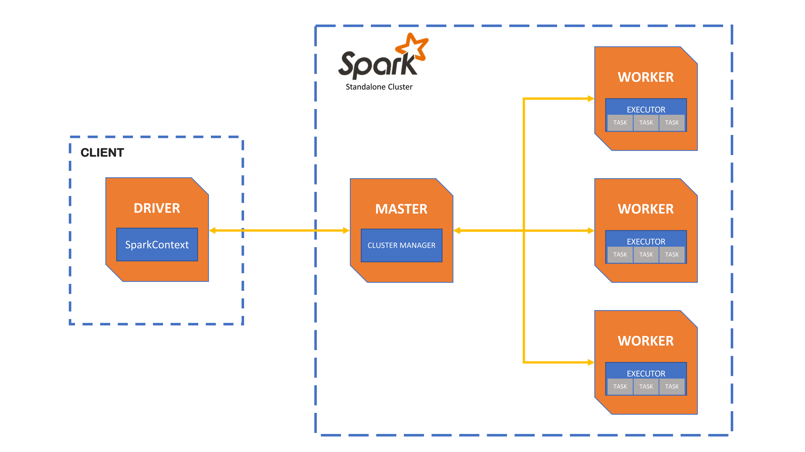
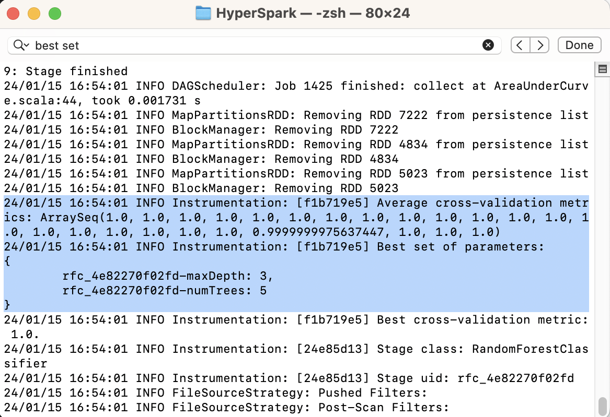

# HyperSpark: Parallelize your Model Finetuning with Apache Spark

## General Use-Case

If you are a machine learning enthusiast, I am sure that you have encountered an event where you need to find the best set of hyperparameters such that your Machine Learning model's performance can be maximized. This process is what we called as model finetuning / hyperparameter tuning. Well, I believe that this part may require us to experiment with multiple sets of hyperparameters where it might be time consuming, especially when your model requires long time for training. Let us take a look at a short story.

Imagine Bob is a Machine Learning Engineer at a Big Tech Multinational Company. He has a project of Obscene Movie Detection for age category classification and banning system, where he needs to deliver a presentation to the Boards of Directors in 3 months. In this project, he has a very large deep learning model that requires 10 hours (with most robust GPU) to finish the training process on a large-scale movie dataset (petabytes in size). In addition, the model has multiple hyperparameters that can be adjusted, where some hyperparameters may be continuous (infinitely many possible values). 

  

Image credit: https://media.springernature.com/m685/springer-static/image/art%3A10.1007%2Fs11042-023-16078-2/MediaObjects/11042_2023_16078_Fig2_HTML.png

After designing his experiment, let's say he would like to test 500 different set of hyperparameters. **Without parallelization**, it will require him to wait for **5000 hours (208 days)**, in which he will not be able to finish the deadline. Hence, as Bob works in a company that has multiple resources on the cloud service, he needs to think about how can he distribute these 500 independent set across multiple machines within the **same network**, to save more time. If let's say he is distributing the tasks such that **1 machine handles one set of hyperparameters**, he will be able to get the best model within **10 hours**. As a result he has more time to test new sets of hyperparameters and performother tasks. However, this may be very expensive especially when he needs to use 500 machines with really high memory. Hence, he can also think of using **125 nodes** where each node handles 4 different set of hyperparameters, which may take **40 hours** to get the best model. There's no definite solution, it all depends on the company's budget, priority, as well as regulation.

Image Credit: https://media.licdn.com/dms/image/D5612AQG_VDh0CtCAzg/article-inline_image-shrink_1500_2232/0/1671461225612?e=1710374400&v=beta&t=K1J1sD5dFNm5CcRfyjux4PqT7YUVi1km5iogBH6Xhcw

## Apache Spark

The good thing is that the issue above can be solved by utilizing Apache Spark. It is a tool that provides the ability for you to distribute your task across multiple nodes where all the processes will be done **in memory** (RAM), and hence improving the speed as well as minimizing the number of I/O operations. Unlike Apache Hadoop, it also provides the functionalities for **Machine Learning** (MLLib) and **Graph Processing** (GraphX), other than Batch Processing. It is supported in **multiple languages** (Python, Java, Scala).

In terms of the architecture, you can see that a spark cluster consists of the spark master as well as multiple spark workers. In this case, **spark master** is responsible to allocate the tasks across the spark workers. While, **spark workers** are responsible to execute the assigned task. Let's say you want to use Spark in your application. You will first need to initialize a **Spark Driver** (client side), and you need to connect your Spark Driver with the Spark Master. 

Image Credit: https://docs.cloud.sdu.dk/Apps/spark-cluster.html

Normally, each node (Spark Master, Spark Worker) is represented as a **single machine** that has its own CPU and RAM. However, if you try to run Spark **locally**, each node will be represented as a **single core**, except for the Spark master. The good thing is that Spark allows a simulated distributed environment on the cores when you are trying to run Spark on local machine. However, Spark may not work effectively in this case, but it is good enough to allow developers to test their Spark application before they proceed with the application deployment.

To allow for in memory processing, Spark uses the **Resilient Distributed Dataset (RDD)** functionality. In addition of the **in-memory storage**, it is also **immutable** to prevent unwanted modification from concurrent operations. Furthermore, it is also divided into partitions where each partition is stored in each node. These features allow seamless parallelization.

## Apache Spark vs Apache Hadoop

  

Image Credit: https://phoenixnap.com/kb/wp-content/uploads/2021/04/hadoop-spark-data-processing.png

**Apache Hadoop** is well known for its **MapReduce** ability, where it performs **batch-processing** by mapping each partition of data across multiple nodes, and then aggregate the results from multiple nodes into 1 object. However, in Hadoop, it will always write every single intermediate data in every single operation **into the disk**, which may not be efficient. For this reason, you can see that Spark can execute tasks much faster (**100x in memory, 10x in disk**) than Hadoop [cited from https://www.analyticsvidhya.com/blog/2022/06/apache-spark-vs-hadoop-mapreduce-top-7-differences/#:~:text=Apache%20Spark%20is%20very%20much,every%20Map%20or%20Reduce%20action.]. However, Spark may not work efficiently when it needs to hancle data that is much larger than the given RAM memory, and RAM is usually much more expensive than SSD/HDD. Hence, if for example, your priority is to **maximize scalability** and **to minimize cost**, and **care less about speed**, Hadoop may be the better option. However, take note that you will need to use external Machine Learning libraries as Hadoop does not support functionalities other than batch-processing. Additionally, it can only be implemented in **Java**.

## Scala vs Python

  

Image Credit: https://dezyre.gumlet.io/images/blog/scala-vs-python-for-apache-spark/Scala_vs_Python_for_Spark.webp?w=376&dpr=2.6

For this project, I will be using **Scala** as the programming language. One of the advantages of Scala compared to Python is that it has built-in functions that support **concurrent programming** and **multithreading**, which will be advantageous for parallel processing. Additionally, it is also more **robust in bug detection**, and hence it can help to minimize the time for debugging. However, take note that Scala is harder to learn compared to Python. But if you have used Java before, Scala is actually similar to it.

## Gradle

Image Credit: https://upload.wikimedia.org/wikipedia/commons/c/cb/Gradle_logo.png

When people are working with Python, they usually use PIP or Anaconda as the package manager to handle all the libraries required to run the application. But for Scala, Java, and C++; **Gradle** will be used as the **package manager**. You can learn on how to run a Scala Application using gradle with the following documentation: https://docs.gradle.org/current/samples/sample_building_scala_applications.html

## Demonstration

For the purpose of learning only, I will try to implement Spark on local machine using **7 cores**, where hypothetically **1 core** is for the **Spark Master** and **6 cores** are for the **spark workers**. The objective is to predict whether a patient has a **diabetes** based on multiple factors such as Age, Blood Pressure, etc. The dataset is taken from Kaggle Link as follows: https://www.kaggle.com/datasets/prosperchuks/health-dataset

I am going to use the RandomForest model for this use case, where I will be testing 6 different **maxDepth** values (3, 6, 9, 12, 15, 18) as well as 4 different **numTrees** values (5, 1, 15, 20), and hence resulting in 6 x 4 = 24 different sets of hyperparameters. 

The aim is to distribute the sets of hyperparameters into multiple nodes (6 different cores), such that each node handles 4 sets of hyperparameters. We will be using the org.apache.spark.ml.tuning.CrossValidator as well as the org.apache.spark.ml.tuning.ParamGrid to allow the parallel hyperparameter tuning.

In the end, we will obtain the best set of hyperparameters as well as the precision score based on the test dataset.

## Result

Based on the local experiment, it can be seen that the best set of hyperparameters is when the tree's maximum depth is 3 and the number of trees is 5.

The good news is we managed to get a **precision of 1**, where you can also see what are the trees that are being generated.

Lastly, as we are using the parallelization, you can see that the model finetuning of 24 different hyperparameters sets only took **26 seconds**.

## Useful Reference

- https://spark.apache.org/docs/3.5.0/api/scala/index.html
- https://docs.gradle.org/current/samples/sample_building_scala_applications.html

## Next Step

- Configure the Spark session such that it runs on HDFS (Hadoop Distributed File System) for higher fault-tolerance as data is being replicated across all data nodes within HDFS.
- Make use of Scala's best coding practices.